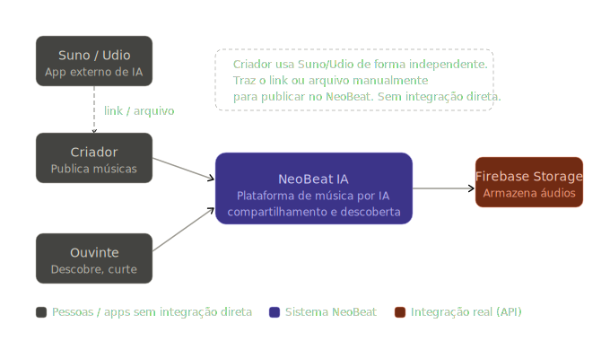
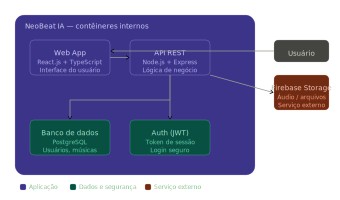
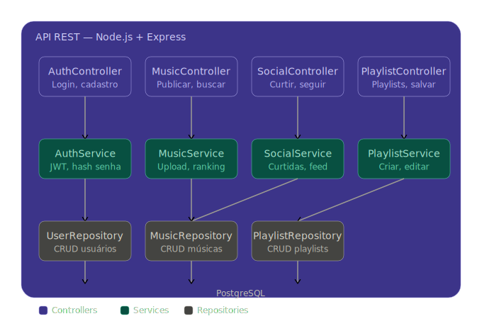
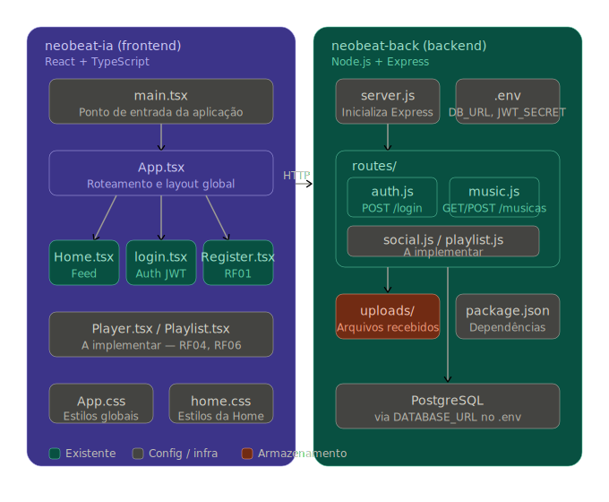

# 🎵 NeoBeat IA

Plataforma web para **compartilhamento e descoberta de músicas geradas por Inteligência Artificial**.

---

# 📌 Sobre o Projeto

Ferramentas como a **Suno** permitem que usuários criem músicas utilizando Inteligência Artificial. No entanto, essas plataformas são focadas principalmente na **geração do conteúdo**, não na **experiência social e descoberta musical**.

O **NeoBeat IA** surge como uma solução para esse cenário, oferecendo uma plataforma dedicada ao **compartilhamento, organização e descoberta de músicas criadas por IA**, em um formato semelhante ao Spotify.

---

# 🎯 Problema Identificado

Atualmente existem algumas limitações no cenário de músicas geradas por IA:

* Falta de um ambiente social voltado para músicas geradas por IA
* Ausência de sistemas de ranking e descoberta
* Dificuldade de encontrar novos criadores de música por IA
* Falta de organização das músicas geradas por usuários

---

# 💡 Solução Proposta

Desenvolver uma plataforma web onde:

* Usuários possam **publicar músicas geradas em ferramentas externas** (ex: Suno)
* Outros usuários possam **ouvir, curtir e salvar músicas**
* O sistema permita **seguir criadores**
* A plataforma apresente **ranking e feed personalizado**

---

# 👥 Público-Alvo

* Criadores de música utilizando IA
* Entusiastas de tecnologia
* Usuários interessados em novas experiências musicais
* Usuarios que queiram Musica sem direito autorais

---

# 📌 Requisitos do Sistema

## 📍 Requisitos Funcionais (RF)

* **RF01** – Permitir cadastro de usuários
* **RF02** – Permitir login e autenticação segura
* **RF03** – Publicação de músicas (link externo ou upload)
* **RF04** – Reprodução das músicas
* **RF05** – Curtir músicas
* **RF06** – Salvar músicas em playlists
* **RF07** – Seguir outros usuários
* **RF08** – Exibir ranking das músicas mais curtidas
* **RF09** – Permitir busca por nome, gênero ou criador

---

## 📍 Requisitos Não Funcionais (RNF)

* **RNF01** – Aplicação responsiva (desktop e mobile)
* **RNF02** – Tempo de carregamento inferior a 3 segundos
* **RNF03** – Autenticação segura utilizando JWT
* **RNF04** – Integridade e consistência no banco de dados
* **RNF05** – Escalabilidade para múltiplos usuários simultâneos

---

# 🏗️ Arquitetura do Sistema

O sistema seguirá o padrão **Cliente-Servidor**, dividido em três camadas principais:

* **Frontend** → Interface web utilizada pelos usuários
* **Backend** → API responsável pela lógica do sistema
* **Banco de Dados** → Armazenamento das informações

---

# 🛠️ Tecnologias Utilizadas

## 🎨 Frontend

**React.js**

Justificativa:

* Criação de interfaces modernas e reativas
* Componentização da interface
* Experiência semelhante a plataformas de streaming

---

## ⚙️ Backend

**Node.js + Express**

Justificativa:

* Desenvolvimento de APIs REST
* Alta performance
* Grande comunidade

---

## 🗄️ Banco de Dados

**PostgreSQL**

Justificativa:

* Banco relacional robusto
* Ideal para relacionamentos entre usuários, músicas e playlists
* Alta confiabilidade

---

## ☁️ Armazenamento de Áudio

**Firebase Storage ou Supabase Storage**

Justificativa:

* Armazenamento seguro de arquivos
* Fácil integração com aplicações web
* Escalabilidade para crescimento da plataforma
* Planos gratuitos adequados para projetos acadêmicos

---

# 📊 Diagramas de Arquitetura (Modelo C4)

A arquitetura do sistema foi modelada utilizando o **Modelo C4**, que permite visualizar o sistema em diferentes níveis de abstração.

Os diagramas apresentados são:

* **Diagrama de Contexto**
* **Diagrama de Containers**
* **Diagrama de Componentes**

---

# 👨‍💻 Organização das Tarefas

## Desenvolvimento Individual

Responsabilidades do desenvolvimento:

### Frontend

* Interface do usuário
* Player de música
* Tela de feed
* Sistema de playlists

### Backend

* Modelagem do banco de dados
* Desenvolvimento da API
* Sistema de autenticação
* Integração com armazenamento

---

# 📊 Funcionalidades Futuras

* Sistema de recomendação baseado em curtidas
* Dashboard do criador com estatísticas
* Sistema de comentários
* Algoritmo de músicas em tendência (Trending)

---

# 📦 Estrutura do Projeto

neobeat-back/
neobeat-ia/
docs/
README.md

---

# 🚀 Objetivo Acadêmico

Este projeto tem como objetivo aplicar conceitos estudados nas disciplinas de:

* Engenharia de Software
* Levantamento de Requisitos
* Projeto e Arquitetura de Software
* Banco de Dados
* Desenvolvimento Full Stack

---

# 📌 Status do Projeto (ATUALIZADO)
🚧 Em desenvolvimento ativo

# ✅ Etapas concluídas
* Estrutura inicial do projeto definida (Frontend + Backend)
* Interface principal desenvolvida em React
* Player de música funcional
* Layout inspirado em plataformas de streaming
* Componentização da interface
* Estrutura de navegação básica implementada
* playlist e criação de playlist funcional
* sistema de downloads de musica funcional
* 

# 🔄 Em desenvolvimento
* Integração completa com backend (API REST)
* Sistema de autenticação (JWT)
* Modelagem e integração com banco de dados (PostgreSQL)
* Funcionalidades sociais (curtir, seguir, adicionar comentario)

# ⏳ Próximas etapas
* Implementação do sistema de ranking
* Feed personalizado
* Sistema de busca avançada
* Otimização de performance
* Deploy da aplicação
